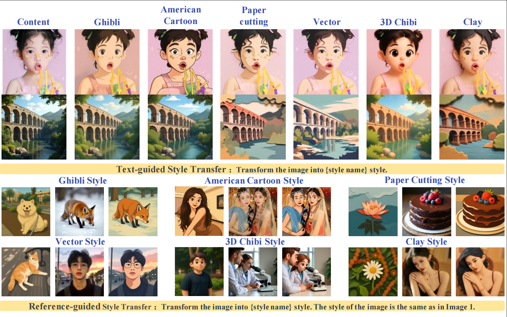

# UniCSG: Unified High-Fidelity Content-Constrained Style-Driven Generation via Staged Semantic and Frequency Disentanglement

Given a content image, UniCSG transforms it into
user-specified styles under both text prompts and reference exemplars, showing faithful content preservation and style alignment. In
the reference-guided rows, each triplet shows (left to right) the reference image, the content image, and the generated result.

## 🚀 Quick Start
### 1. Environment Setup
```bash
# Clone DiffSynth base repo
git clone https://github.com/modelscope/DiffSynth‑Studio.git
cd DiffSynth‑Studio
pip install -e .

# Clone UniCSG project files into workspace
git clone https://github.com/Jankinwei/UniCSG ./unicsg
cd unicsg
```

### 2. Model Base & Resource Info
- Backbone Base Model: [Qwen‑Image‑Edit‑2509](https://huggingface.co/Qwen/Qwen-Image-Edit-2509)
- Acceleration LoRA: [Qwen‑Image‑Lightning](https://huggingface.co/lightx2v/Qwen-Image-Lightning)
- Custom UniCSG task‑specific LoRAs: coming soon
- Training Dataset: Built on [OmniConsistency](https://github.com/showlab/OmniConsistency) & [OmniStyle](https://github.com/StyleX-Research/OmniStyle)
- Evaluation Benchmark: CSG‑Bench

### 3. Inference
```bash
python infer_style_transfer.py
```

## 📅 Release Schedule
- Full training & inference code: Coming soon
- Pre-trained checkpoint: To be released together

## 📌 Citation
If our work is helpful to your research, please cite our paper:
```bibtex
@misc{yang2026unicsgunifiedhighfidelitycontentconstrained,
      title={UniCSG: Unified High-Fidelity Content-Constrained Style-Driven Generation via Staged Semantic and Frequency Disentanglement}, 
      author={Jingwei Yang and Ruoxi Wu and Wei Shen and Meng Li and Yulong Liu and Huimin She and Lunxi Yuan},
      year={2026},
      eprint={2604.17850},
      archivePrefix={arXiv},
      primaryClass={cs.CV},
      url={https://arxiv.org/abs/2604.17850}, 
}
